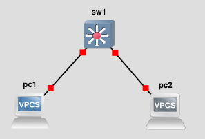
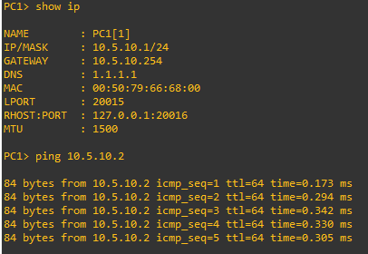
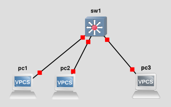
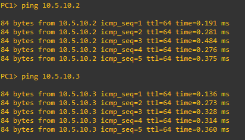

# Sujet Réseau et Infra

# Sommaire

- [Sujet Réseau et Infra](#sujet-réseau-et-infra)
- [Sommaire](#sommaire)

- [I. Dumb switch](#i-dumb-switch)
  - [1. Topologie 1](#1-topologie-1)
  - [2. Adressage topologie 1](#2-adressage-topologie-1)
  - [3. Setup topologie 1](#3-setup-topologie-1)

- [II. VLAN](#ii-vlan)
  - [1. Topologie 2](#1-topologie-2)
  - [2. Adressage topologie 2](#2-adressage-topologie-2)
    - [3. Setup topologie 2](#3-setup-topologie-2)

- [III. Routing](#iii-routing)
  - [1. Topologie 3](#1-topologie-3)
  - [2. Adressage topologie 3](#2-adressage-topologie-3)
  - [3. Setup topologie 3](#3-setup-topologie-3)

- [IV. NAT](#iv-nat)
  - [1. Topologie 4](#1-topologie-4)
  - [2. Adressage topologie 4](#2-adressage-topologie-4)
  - [3. Setup topologie 4](#3-setup-topologie-4)

- [V. Add a building](#v-add-a-building)
  - [1. Topologie 5](#1-topologie-5)
  - [2. Adressage topologie 5](#2-adressage-topologie-5)
  - [3. Setup topologie 5](#3-setup-topologie-5)

## 1. Topologie 1

## 2. Adressage topologie 1

| Node  | IP            |
|-------|---------------|
| `pc1` | `10.1.1.1/24` |
| `pc2` | `10.1.1.2/24` |

## 3. Setup topologie 1

🌞 **Commençons simple**

- définissez les IPs statiques sur les deux VPCS
- `ping` un VPCS depuis l'autre

> Jusque là, ça devrait aller. Noter qu'on a fait aucune conf sur le switch. Tant qu'on ne fait rien, c'est une bête multiprise.

# II. VLAN

**Le but dans cette partie va être de tester un peu les *VLANs*.**

On va rajouter **un troisième client** qui, bien que dans le même réseau, sera **isolé des autres grâce aux *VLANs***.

**Les *VLANs* sont une configuration à effectuer sur les *switches*.** C'est les *switches* qui effectuent le blocage.

Le principe est simple :

- déclaration du VLAN sur tous les switches
  - un VLAN a forcément un ID (un entier)
  - bonne pratique, on lui met un nom
- sur chaque switch, on définit le VLAN associé à chaque port
  - genre "sur le port 35, c'est un client du VLAN 20 qui est branché"

## 1. Topologie 2

## 2. Adressage topologie 2

| Node  | IP            | VLAN |
|-------|---------------|------|
| `pc1` | `10.1.1.1/24` | 10   |
| `pc2` | `10.1.1.2/24` | 10   |
| `pc3` | `10.1.1.3/24` | 20   |

### 3. Setup topologie 2

🌞 **Adressage**

- définissez les IPs statiques sur tous les VPCS
- vérifiez avec des `ping` que tout le monde se ping

🌞 **Configuration des VLANs**

- référez-vous [à la section VLAN du mémo Cisco](../../cours/memo/memo_cisco.md#8-vlan)
- déclaration des VLANs sur le switch `sw1`
- ajout des ports du switches dans le bon VLAN (voir [le tableau d'adressage de la topo 2 juste au dessus](#2-adressage-topologie-2))
  - ici, tous les ports sont en mode *access* : ils pointent vers des clients du réseau

🌞 **Vérif**

- `pc1` et `pc2` doivent toujours pouvoir se ping
- `pc3` ne ping plus personne

